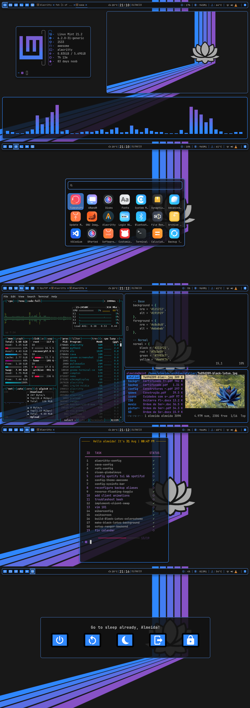

# BlackLotus - color scheme

Dark, dim, blue, purple, beautiful!

BlackLotus is a color theme inspired by Christopher Rush's MTG Black Lotus artwork.

The main colors are reminescent from the lotus flower itself:
- reddish-purplish dark gray tones for background
-  yellowish-greenish dim white tones for foreground
-  dim or bright blue and purple options for accent color

All colors were picked from the artwork directly. With just a few exceptions, to build a cohesive palette. 

You can find the complete Hex-list [here](https://github.com/PoisonIsBestType/BlackLotus/blob/main/hex-list.txt)

Exemples:

- Desktop

- Text

- Full desktop sample

This repository contains a noob's side-project, don't expect much.

### Have a good one!
