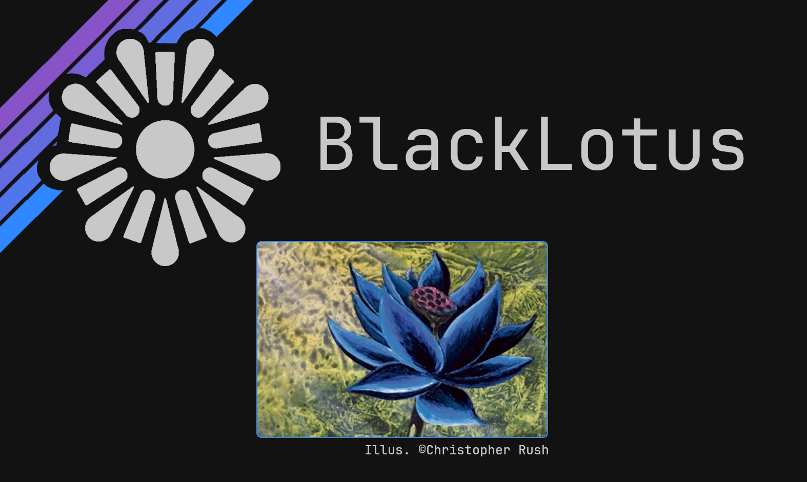

# BlackLotus Color-scheme

Dark, dim, blue/purple oriented... beautiful!

BlackLotus is a color theme inspired on the great artwork by the late Christopher Rush, the main colors are reminescent from the lotus flower itself.
All colors were picked from the artwork directly. With just a few exceptions, to build a cohesive palette. 

You can find the complete Hex-list [here](https://github.com/PoisonIsBestType/BlackLotus/blob/main/hex-list.txt)

Exemples:

Desktop

Text

This repository contains a noob's side-project, don't expect much.

### Have a good one!
