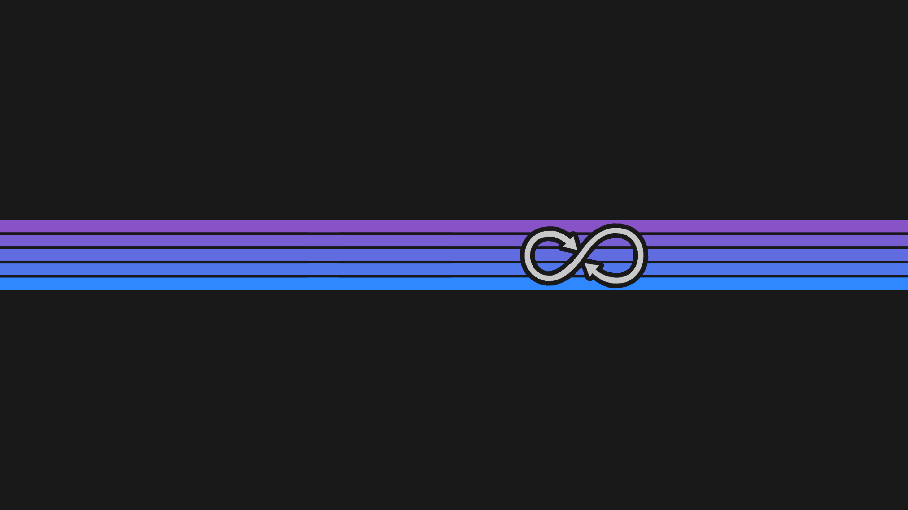
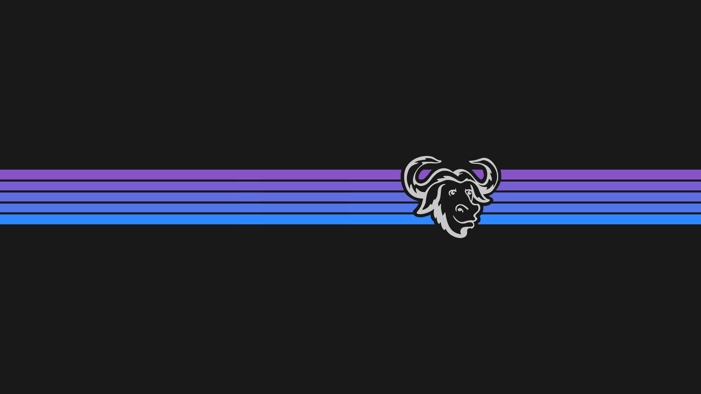

<h1 align="center"> BlackLotus</h1>

<i>A colorscheme.</i> 

_______

<h3 align="center"> Dark, dim, blue, purple... beautiful!</h3>

BlackLotus is a color theme inspired by Christopher Rush's MTG Black Lotus artwork.
The main colors are found in the lotus flower itself:
- reddish/purplish dark gray tones for background
-  yellowish/greenish dim white tones for foreground
-  dim or bright blue and purple options for accent color 

All colors were picked from the artwork directly, with just a few exceptions to build a cohesive palette.
_______

<h3 align="center">🎨 PALETTE 🎨</h3> 

_______

<h3 align="center">You can find the complete Hex list <i><a href="https://github.com/PoisonIsBestType/BlackLotus/blob/main/hex-list.txt">HERE</a></h3> 

If you decide to apply this color scheme anywhere please consider sending us a screenshot to be featured here!
</i>

_______

<h3 align="center">📷 GALERY 📷</h3>

 

<b>
Click here 
</b>

  
_______
  

Desktop 

Ranger 

BpyTOP 

Rofi 

Text 

_______

<h3 align="center">🖼 SCREENSHOTS 🖼</h3>

 

<b>
Click here 
</b>

  
_______
  

almeidaromim (as seen on <a href="https://www.reddit.com/r/unixporn/comments/16xintv/awesomewm_blacklotus/">Redit</a>) 

ShakeyAZ (as seen on <a href="https://reddit.com/r/unixporn/s/6KRMk44m0q">Redit</a>) 

Android 

_______

<h3 align="center">🌄 BACKGROUNDS 🌄</h3>

 

<b>
Click here 
</b>

_______

This is a noob's repository, don't expect much!

Have a good one!

