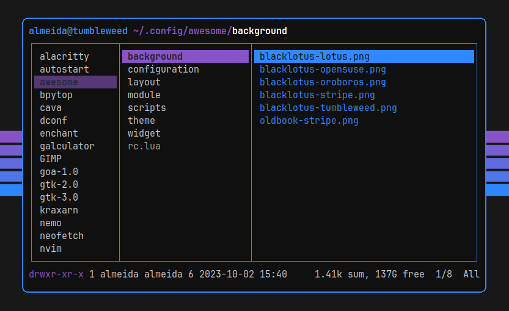
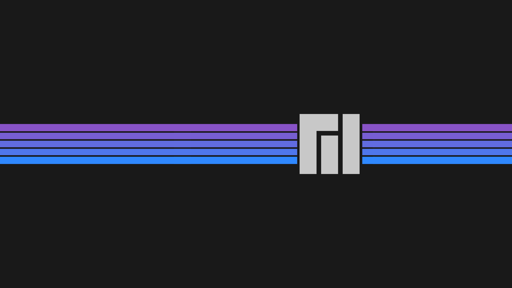

# BlackLotus, a color scheme.

### Dark, dim, blue, purple... beautiful!

BlackLotus is a color theme inspired by Christopher Rush's MTG Black Lotus artwork.
The main colors are found in the lotus flower itself:
- reddish/purplish dark gray tones for background
-  yellowish/greenish dim white tones for foreground
-  dim or bright blue and purple options for accent color 

All colors were picked from the artwork directly, with just a few exceptions to build a cohesive palette.

### You can find the complete Hex list [here](https://github.com/PoisonIsBestType/BlackLotus/blob/main/hex-list.txt).
- If you decide to apply this color scheme anywhere please consider sending us a screenshot to be featured here!

## Examples:
- Desktop

- Ranger

- BpyTOP

- Text

## Screenshots
- ShakeyAZ (as seen on Reddit [here](https://reddit.com/r/unixporn/s/6KRMk44m0q))

## Backgrounds

This repository contains a noob's side-project, don't expect much.
### Have a good one!
